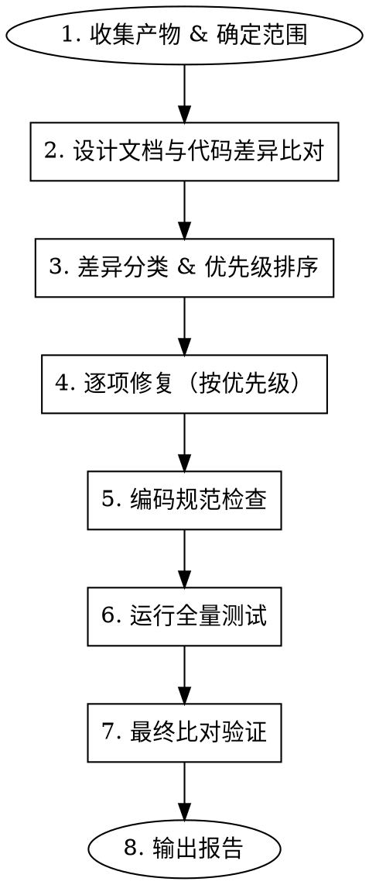

# 代码审查

> 对代码进行全面审查：设计文档比对 → 编码规范检查 → 测试验证 → 问题修复 → 最终报告。
> 审查以设计文档为权威基准，代码必须对齐设计文档。

## 适用时机

- 新功能实现完成后
- 继承已有代码库时
- 代码修改可能影响多个模块时
- 定期代码质量审计
- 用户明确要求代码审查

## 参数

以 `ashhyc:code-review` 调用，支持可选参数：

| 参数 | 取值 | 默认值 | 含义 |
|------|------|--------|------|
| scope | `module` / `full` | `full` | `module` = 审查指定模块；`full` = 审查全部代码 |
| fix | `yes` / `no` | `yes` | `yes` = 发现问题后自动修复；`no` = 仅报告不修复 |

**调用示例：**
- `ashhyc:code-review` — 全量审查 + 自动修复
- `ashhyc:code-review module core` — 仅审查 core 模块 + 自动修复
- `ashhyc:code-review full no` — 全量审查 + 仅报告

## 核心原则

1. **设计优先**：代码不可以决定设计文档，必须以设计文档为准。代码实现与设计文档冲突时，以设计文档为权威，代码需对齐文档。
2. **先核实再回答**：引用代码行为前必须实际读取源文件确认当前实现状态，不得凭记忆假设。
3. **彻底修复**：发现的问题必须逐一彻底修复，不可绕过或留 TODO。
4. **不改已测试代码**：已测试通过的代码原则上不修改，需修改时必须向用户提交修改申请。

## 流程



### 第1步：收集产物 & 确定范围

**收集设计文档：**
- 从项目的文档目录（通常 `docs/`）获取架构设计文档
- 确定哪些模块有详细设计文档（需要完整实现）
- 确定哪些模块无详细设计文档（框架代码即可）

**收集代码产物：**
- 源代码文件
- 测试文件
- 测试规格文档（如存在）

**收集辅助文件：**
- 项目中的设计决策记录
- 技术参考文档
- 项目级 `CLAUDE.md` 中的编码约束

### 第2步：设计文档与代码差异比对

对每个有详细设计的模块，逐一比对：

**比对维度：**

| 维度 | 检查内容 |
|------|---------|
| 接口签名 | 类/方法/函数的参数、返回值、异常是否与设计文档一致 |
| 数据字段 | dataclass/model 的字段名、类型、默认值是否与设计文档一致 |
| 流程顺序 | 启动流程、处理链、状态转换顺序是否与设计文档一致 |
| 配置项 | 配置键名、默认值、校验规则是否与设计文档一致 |
| 数据模型 | 数据库表结构、字段类型、约束、索引是否与设计文档一致 |

**比对方法：**
1. 读取设计文档中的接口设计/数据结构定义
2. 读取对应源代码文件
3. 逐项对比，记录差异

### 第3步：差异分类 & 优先级排序

#### 3.1 修复方向判定

发现差异后，首先判定修复方向——**修改代码**还是**修改设计文档**：

**修改设计文档**（仅在以下情况）：
1. **流程走不通**：按设计文档的字面描述实现代码，会导致业务流程无法正常运行（如设计遗漏了必要的依赖声明、步骤之间有逻辑断裂）
2. **需要大量冗余代码**：严格按设计实现需要引入显著的冗余逻辑（如设计遗漏了外部系统实际返回的字段、模块级函数无法 Mock 外部依赖需改为类）
3. **设计内部矛盾**：同一份设计文档内两处描述互相矛盾（如表归为隔离数据但 DDL 无 `{mode}_` 前缀）

**修改代码**（默认方向）：
- 除上述三种情况外，所有差异一律修改代码对齐设计文档
- "代码更优雅""代码更实用"不构成修改设计的理由——设计是权威基准
- 如果设计确实不合理，应先通过设计变更流程修改文档，再改代码

#### 3.2 严重度分级

将差异按严重程度分为三级：

| 严重度 | 定义 | 示例 |
|--------|------|------|
| **Critical** | 设计文档要求的核心功能缺失或关键数据结构不一致 | 缺少关键字段、缺少关键流程步骤、数据模型与设计不匹配 |
| **Important** | 接口不完整、推断逻辑缺失、配置校验不充分 | 缺少默认值推断、缺少条件必填校验、接口签名不完整 |
| **Minor** | 注释不精确、命名不完全一致、非关键默认值差异 | 日志描述与设计不同、非关键参数默认值不同 |

#### 3.3 排序规则

1. Critical → 必须修复
2. Important → 必须修复
3. Minor → 修复或记录

向用户展示分类结果（含修复方向：改代码 / 改设计），确认后执行修复。

### 第4步：逐项修复（按优先级）

**修复原则：**
- 先修复 Critical，再 Important，最后 Minor
- 每项修复后运行相关测试验证不引入回归
- 涉及多文件修改时遵循项目 CLAUDE.md 中的多文件变更流程
- 修改已测试通过的代码前必须向用户提交修改申请

**修复记录格式：**
```
修复N: [文件名] — 修复内容简述
- 变更: ...
- 影响范围: ...
- 测试验证: ...
```

**补充检查 — 审查中高频出现的问题：**

| 问题类型 | 说明 | 典型案例 |
|----------|------|---------|
| 日志库保留参数名冲突 | structlog 等日志库保留 `event`、`time` 等参数名，传入同名参数会报 TypeError | `logger.debug("...", event=xxx)` → 改用 `event_type=xxx` |
| 平台编码问题 | `write_text()` 在中文 Windows 默认使用 GBK，Python 导入需要 UTF-8 | 创建文件时必须加 `encoding="utf-8"` |
| Optional 类型窄化 | mypy 要求访问 Optional 属性前先 assert 或 if 检查 | `self._config.xxx` → `assert self._config is not None` |
| 未使用的导入 | ruff F401 对未使用的 import 报错 | 清理未使用的 import |
| conda run 脚本限制 | `conda run -n env python -c "..."` 多行脚本在 Windows 下可能换行符异常 | 改用 Python 路径直接执行 |

### 第5步：编码规范检查

按项目工具链运行检查（根据 `ashhyc:coding` 中定义的工具链）：

```bash
ruff check .           # Lint 检查
ruff format --check .  # 格式化检查
mypy {package}/        # 类型检查
bandit -r {package}/   # 安全扫描（Python 项目）
```

**处理规则：**
- `ruff check` 报错 → 必须修复（可用 `ruff check --fix` 自动修复）
- `ruff format` 报错 → 运行 `ruff format .` 自动格式化
- `mypy` 报错 → 必须修复（通常需要 assert 窄化 Optional 类型）
- `bandit` HIGH → 必须修复；MEDIUM（LOW confidence）→ 记录，不阻塞
- 每次修复后重新运行全部检查

### 第6步：运行全量测试

```bash
python -m pytest tests/ -v
```

**测试要求：**
- 全部测试通过，0 失败
- 关注测试覆盖率（核心模块 > 85%）
- 性能基准未退化（benchmark 测试）
- 新增代码有对应测试

**测试失败处理：**
- 分析失败原因（设计文档要求 vs 测试期望 vs 代码实现）
- 如测试期望与设计文档一致 → 修复代码
- 如测试期望与设计文档不一致 → 修复测试对齐设计文档
- 修复后重新运行全量测试

### 第7步：最终比对验证

修复完成后，再次进行设计文档与代码的快速比对：
1. 抽查 Critical 修复项是否真正对齐设计文档
2. 检查修复是否引入新的不一致
3. 确认无遗漏的设计要求

### 第8步：输出报告

**报告格式：**

```markdown
## 代码审查报告

### 代码质量检查结果
| 检查项 | 结果 |
|--------|------|
| ruff check | X errors |
| ruff format | X files need formatting |
| mypy | X errors |
| bandit | X HIGH, X MEDIUM |
| pytest | X passed, X failed |

### 修复汇总
**Critical 修复（X项）：**
1. [文件名] — 修复内容

**Important 修复（X项）：**
...

**新增测试：** X tests

### 剩余差异（需后续处理）
| # | 差异 | 严重程度 | 说明 |
|---|------|---------|------|

### 需要调整设计文档的差异
（仅列出满足"流程走不通 / 大量冗余代码 / 设计内部矛盾"条件的差异）

| # | 设计文档位置 | 差异描述 | 调整原因 | 建议方案 |
|---|------------|---------|---------|---------|
```

## 红旗 — 立即停止

- 以"代码看起来没问题"跳过设计文档比对 — 必须逐项比对
- 发现问题但不修复直接记录 TODO — 必须彻底修复
- 修改已测试通过的代码未经用户批准 — 必须提交修改申请
- lint/类型检查 报错视为"可接受" — 必须修复
- 测试失败被视为"已知问题"跳过 — 必须修复到通过
- 跳过最终比对验证直接出报告 — 修复后必须重新验证
- 凭记忆判断代码行为 — 必须实际读取文件确认

## 常见借口对照

| 借口 | 事实 |
|------|------|
| "设计文档和代码差不多" | 差不多 ≠ 一致，必须逐项确认 |
| "这些 lint 错误一直都在" | 存量错误也必须修复 |
| "测试只是小改动就能过" | 小改动可能掩盖设计不一致 |
| "这个模块没有详细设计" | 无详细设计的模块至少要满足编码规范 |
| "改动太多了先不改" | 每个问题都应修复，不可绕过 |
| "性能没问题" | 必须跑 benchmark 验证，不能凭感觉 |
