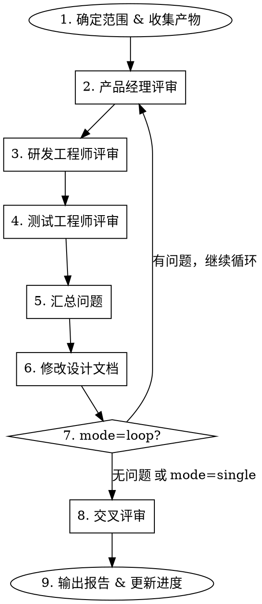

# 设计文档评审

## 概述

三角色结构化评审：产品经理、研发工程师、测试工程师各从自身角度独立评审设计文档，评审完成后对已有实施产物做交叉验证。

**核心原则：** 每一项设计变更必须经受三个独立视角的审视才能被接受。

## 参数

以 `ashhyc:design-review` 调用，支持可选参数：

| 参数 | 取值 | 默认值 | 含义 |
|------|------|--------|------|
| mode | `single` / `loop` | `single` | `single` = 一次评审+修改；`loop` = 反复评审修改直到零问题 |
| scope | `chapter` / `full` | `chapter` | `chapter` = 单章节评审；`full` = 全文档评审 |

**调用示例：**
- `ashhyc:design-review` — 单次模式，单章节
- `ashhyc:design-review loop` — 循环模式，单章节
- `ashhyc:design-review single full` — 单次模式，全文档
- `ashhyc:design-review loop full` — 循环模式，全文档

## 适用时机

- 设计讨论结束后，文档需要正式确认
- 从设计阶段转入实施阶段之前
- 设计修改可能影响其他章节时
- 长周期实施过程中的定期设计审计

## 流程



### 第1步：确定范围 & 收集产物

确定评审目标：
- **chapter**：确定目标章节（不明确时询问用户），收集该章节设计文档
- **full**：收集架构索引中列出的所有设计文档

收集已有产物用于后续交叉评审（尚未实现的跳过）：
- 实施文档（如已编写）
- 源代码文件（如已实现）
- 测试文件及测试结果（如已编写）
- 需求文档（`.claude/QA/` 目录及设计文档）

### 第2步：产品经理评审

**视角：** "这个设计是否解决了用户的正确问题？"

检查清单：
- [ ] 设计与 `.claude/QA/` 中的需求讨论记录一致
- [ ] 所有用户场景已覆盖（无功能缺口）
- [ ] 可用性：用户能否通过此设计达成目标
- [ ] 用户视角的边界情况是否已处理
- [ ] `docs/architecture/16-user-constraints.md` 中的约束是否被遵守
- [ ] 没有超出需求范围的过度设计
- [ ] 术语一致且可理解

**输出格式：**
```
## 产品经理评审问题
| # | 严重度 | 章节 | 问题描述 | 建议修改 |
|---|--------|------|----------|----------|
```

严重度：`Critical`（阻断）/ `Important`（必须修改）/ `Minor`（建议修改）

### 第3步：研发工程师评审

**视角：** "这个设计能否被正确实现和维护？"

检查清单：
- [ ] 技术方案合理且有充分依据
- [ ] 数据结构和算法选型适当
- [ ] 接口/契约定义清晰（输入、输出、错误处理）
- [ ] 设计内部无矛盾，与其他章节无冲突
- [ ] 性能特征满足 `docs/architecture/10-performance.md` 要求
- [ ] 错误处理和恢复路径已明确
- [ ] 对其他层的依赖已清晰说明
- [ ] 命名与现有代码库惯例一致
- [ ] 现有代码实现与设计一致（如代码已存在）
- [ ] 设计修改不会破坏已实现的代码（如代码已存在）

**输出格式：**
```
## 研发工程师评审问题
| # | 严重度 | 章节 | 问题描述 | 建议修改 |
|---|--------|------|----------|----------|
```

### 第4步：测试工程师评审

**视角：** "我们能否验证这个设计被正确实现了？"

检查清单：
- [ ] 每个功能需求都有可测试的预期结果
- [ ] 测试场景覆盖正常路径 + 异常路径 + 边界条件
- [ ] 性能测试指标可量化且符合性能文档要求
- [ ] 稳定性/恢复场景可测试
- [ ] 层间集成点有测试规范
- [ ] 现有测试用例覆盖了设计内容（如测试已存在）
- [ ] 设计变更后现有测试用例仍然对齐（如测试已存在）
- [ ] 测试数据准备需求已说明

**输出格式：**
```
## 测试工程师评审问题
| # | 严重度 | 章节 | 问题描述 | 建议修改 |
|---|--------|------|----------|----------|
```

### 第5步：汇总问题

合并三个角色的评审输出。去重，按优先级排列：
1. 任何角色的 `Critical` → 必须修改
2. 多个角色的 `Important` → 必须修改
3. 单个角色的 `Important` → 与用户讨论决定
4. `Minor` → 批量留后处理

向用户展示汇总清单，确认后再执行修改。

### 第6步：修改设计文档

编辑设计文档以解决已确认的问题。每项修改：
- 在文档中标记变更位置
- 将修改原因记录到 `.claude/QA/` 或 `.claude/review/`

**重要：** 根据 CLAUDE.md 约束 — 如果修改需要变更已实现的代码，必须暂停并向用户提交修改申请，附详细影响分析。

### 第7步：循环检查

- `mode=loop` 且发现问题 → 返回第2步
- `mode=loop` 且零问题 → 进入第8步
- `mode=single` → 直接进入第8步

### 第8步：交叉评审

设计评审完成后，对已有实施产物做交叉验证。尚未实现的产物跳过。

**对设计评审中的每个修改点：**

1. 定位实施文档中对应章节 → 检查是否需要对齐
2. 定位源代码中对应文件/函数 → 检查是否与更新后的设计一致
3. 定位测试文件中对应用例 → 检查是否覆盖更新后的设计
4. 发现不一致时标记并报告用户

**交叉评审检查表：**

| 产物 | 交叉检查内容 | 处理方式 |
|------|-------------|----------|
| 实施文档 | 设计变更是否反映到实施计划中？ | 汇报用户，确认后修改 |
| 源代码 | 代码实现是否与更新后的设计一致？ | 汇报用户，确认后修改 |
| 测试代码 | 测试用例是否覆盖更新后的设计？ | 汇报用户，确认后修改 |
| 测试结果 | 所有测试是否仍然通过？ | 汇报用户，确认后修改 |

**处理规则：**
- 设计文档本身的问题 → 直接修改，回到三角色评审（纳入循环）
- 实施文档/代码/测试的问题 → 不直接修改，汇总后提交用户确认
  - 用户同意 → 立刻实施修改
  - 用户不同意 → 关联产物保持现状

**输出格式：**
```
## 交叉评审结果
| 设计章节 | 实施文档 | 源代码 | 测试 | 状态 |
|----------|---------|--------|------|------|
```

状态：`一致` / `不一致（详情）` / `未实现`

### 第9步：输出报告 & 更新进度

生成最终报告：
1. 评审摘要（循环轮次、发现/修复问题数）
2. 交叉评审对齐状态
3. 建议的后续步骤

更新 `.claude/schedule/schedule.md` 记录评审完成状态。

## 常见借口对照

| 借口 | 事实 |
|------|------|
| "设计看起来没问题" | 三个角色都必须确认，不是一个视角说了算 |
| "我们已经讨论过了" | 讨论 ≠ 结构化评审，遗漏仍然存在 |
| "只是小问题" | 小问题会累积，必须修复 |
| "交叉评审太过了" | 产物不一致是生产bug的主要来源 |
| "还没有代码，跳过交叉评审" | 正确 — 尚未实现的产物跳过即可 |
| "一个角色就够了" | 每个角色能发现其他角色遗漏的问题 |
| "改完直接往下走" | 循环模式下修改后必须重新评审 |

## 红旗 — 立即停止

- 以"不相关"为由跳过某个角色 — 三个角色全部必须参与
- 未编辑文档就标记问题为"已解决"
- 交叉评审未完成就进入实施阶段
- 未经用户批准修改已实现的代码
- 未完整阅读检查清单就声称"没有问题"
